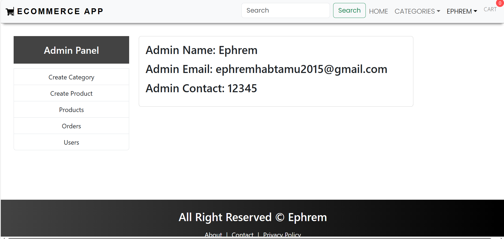
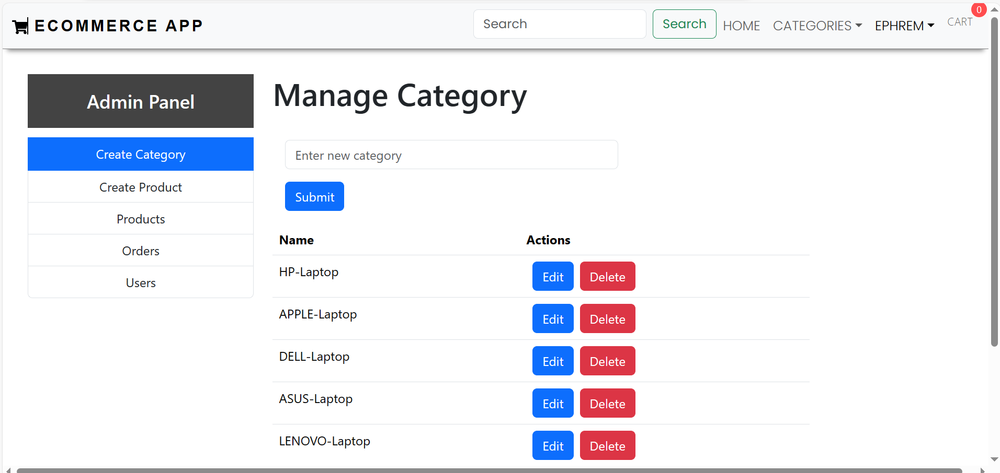
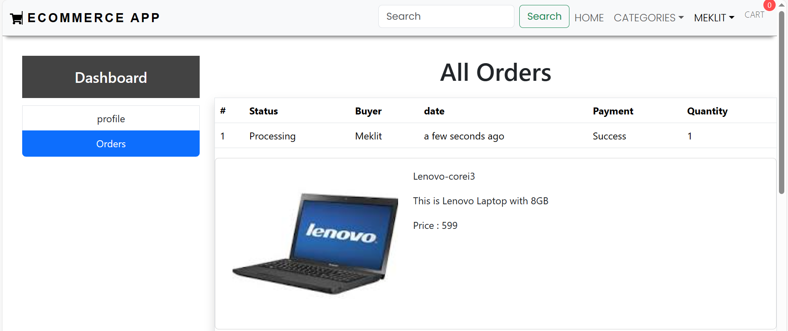
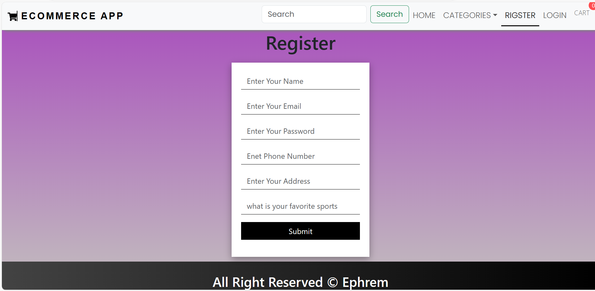
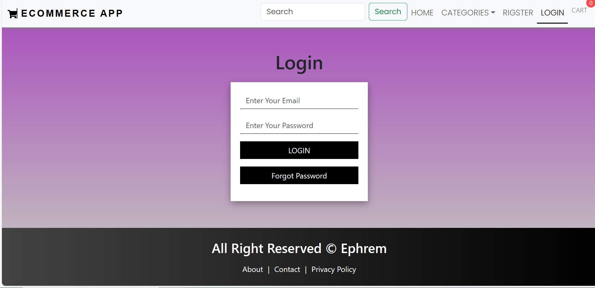

# ecommerce-web-app

Introducing our latest e-commerce venture, a seamlessly integrated platform designed for modern shopping convenience. The project is a comprehensive solution to redefine the way users shop, providing an efficient, secure, and enjoyable experience from start to finish.

## Screenshots


*Home Page*



*Admin Dashboard*


*User Dashboard*


*Register Page*


*Login page*

## Project Details

- **Developer:** Ephrem Tadesse ([GitHub](https://github.com/EphriamHab))

## Features

- **Admin Dashboard:** Effortless management with a feature-rich admin dashboard.
- **User Registration/Login:** Streamlined user authentication for a personalized experience.
- **Add to Cart Functionality:** Smooth shopping process with a user-friendly cart system.
- **Payment Integration:** Secure transactions through Braintree's API, supporting various payment methods including cards and PayPal.
- **Product Filtering:** Intuitive product filtering by category for easy navigation.

## Getting Started

1. Clone the repository:

   ```bash
   git clone https://github.com/EphriamHab/ecommerce-web-app.git

2. Install dependencies:

```bash
npm install
```
3. Run the palication
```bash
npm run dev
```

# Tech Stack
- **Frontend:** React.js
- **Backend:** Node.js, Express.js
- **Database:** MongoDB
- **Payment Gateway:** Braintree API

# Project Structure
The project follows a standard MERN stack structure.

# Contributors
- **Ephrem Habtamu:** Full Stack Developer ([GitHub](https://github.com/EphriamHab))

# Learning Journey
Ephrem Habtamu gained proficiency in the MERN stack, understood e-commerce app architecture, developed secure user authentication, and successfully implemented Braintree's API for payment gateway integration.

# Timeline
The project was completed in less than 3 weeks.

# Security
Secure user authentication has been implemented to ensure the safety of user data.

# Integration
Braintree's API is seamlessly integrated to support a variety of payment methods, including card and PayPal.

# Deployment

The project is deployed using [Cyclic.sh](https://cyclic.sh/). You can access the deployed application at the following link:

[Live Demo](https://fine-erin-wildebeest-tam.cyclic.app)

## Instructions for Deployment

1. **Build and Deploy:**
   To deploy the project on your own, follow these steps:

   ```bash
   # Build the project
   npm run build

   # Deploy using Cyclic.sh
   # Add specific deployment commands or details as needed
   cyclic deploy


# License
This project is licensed under the MIT License.


